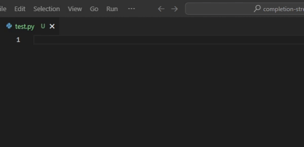

(.vsix is provided in repo)

Current prompt template is starcoder's fill-in-the-middle, like this:
```
<fim_prefix>def print_hello_world():\n    <fim_suffix>\n    print('Hello world!')<fim_middle>
```
